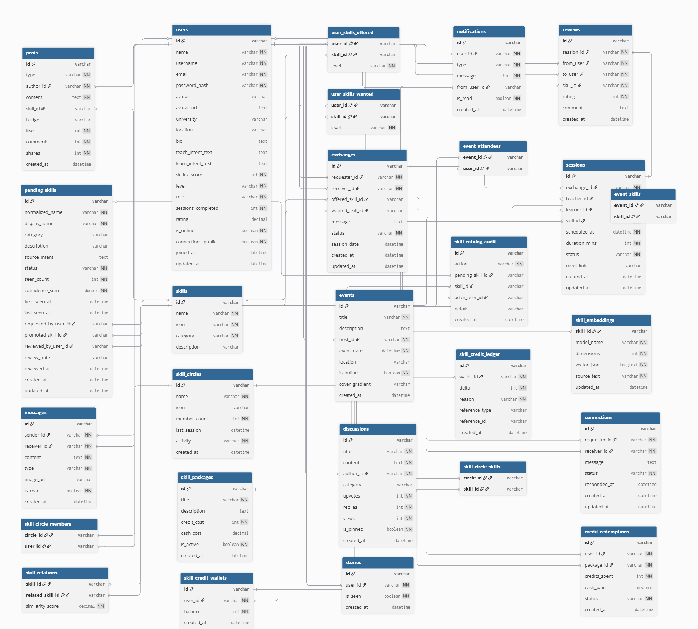

# SkillEX - Update 2: Controller

This repository contains the Entity, Repository, Service, and Controller layers for the SkillEX project based on the EER diagram.

## EER Diagram



## Assignment Scope

- Entity classes are inside `src/main/java/com/cse/project/entity`
- Repository interfaces are inside `src/main/java/com/cse/project/repository`
- Shared service logic is inside `src/main/java/com/cse/project/service`
- REST controllers are inside `src/main/java/com/cse/project/controller`
- H2 in-memory database is used, so no manual database setup is required
- No frontend is included in this update

## REST API

Every entity has basic CRUD endpoints under `/api`.

```text
GET    /api/users
GET    /api/users/{id}
POST   /api/users
PUT    /api/users/{id}
DELETE /api/users/{id}
```

Composite-key endpoints use comma-separated IDs, for example:

```text
GET /api/user-skills-offered/{userId},{skillId}
GET /api/event-attendees/{eventId},{userId}
GET /api/skill-relations/{skillId},{relatedSkillId}
```


